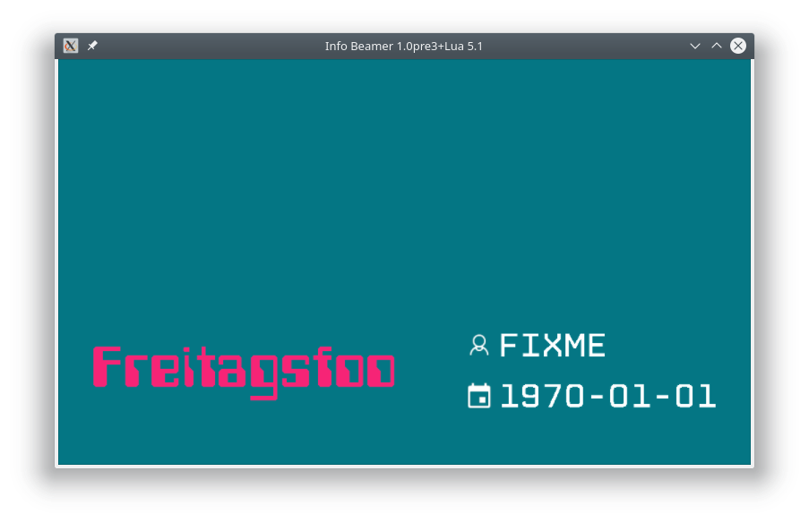
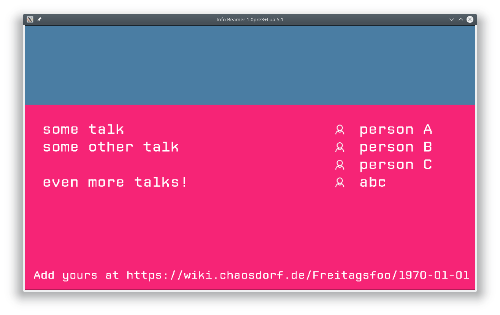

# info-beamer software for Freitagsfoo

This software is meant to be used on info-beamer during a [Freitagsfoo](https://wiki.chaosdorf.de/Freitagsfoo).

> 
> 
> *title screen*

> 
> 
> *talks screen*

## main node

This folder contains the main node which does the animations and switches between the different screens.

## background

You need to configura a background by adding a child package called `background`. A simple background which just paints a black screen is included.

## Credits

Used fonts:
 * *Computerfont*: public domain
 * *CP Mono*: CC by Liquitype

Used icons:
 * `user.png`: CC by-nd icons8.com
 * `planner.png`: CC by-nd icons8.com
 * `pesthoernchen.svg`: [muelli](https://blogs.gnome.org/muelli/2009/09/ccc-artwork/)
