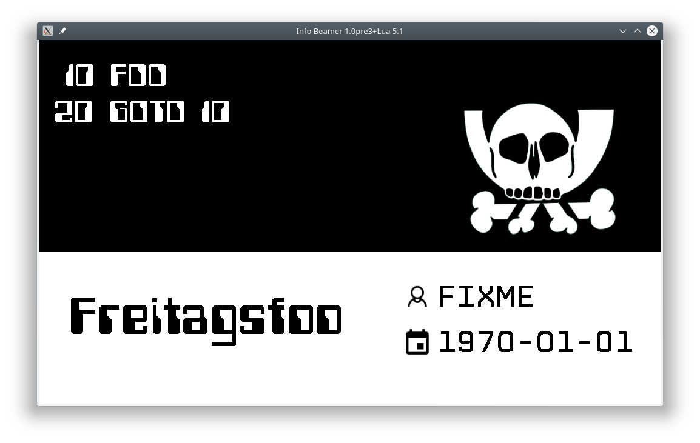
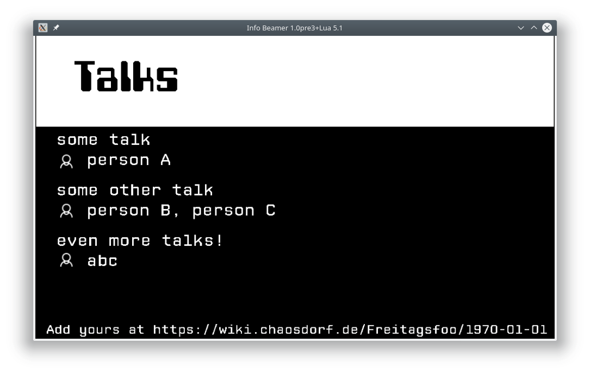
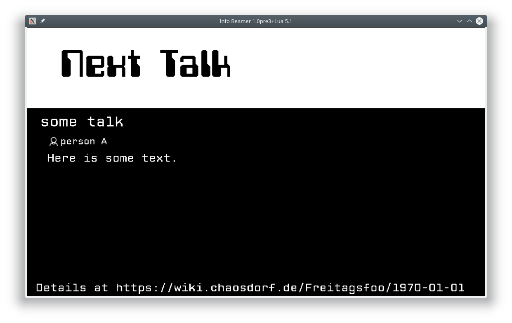
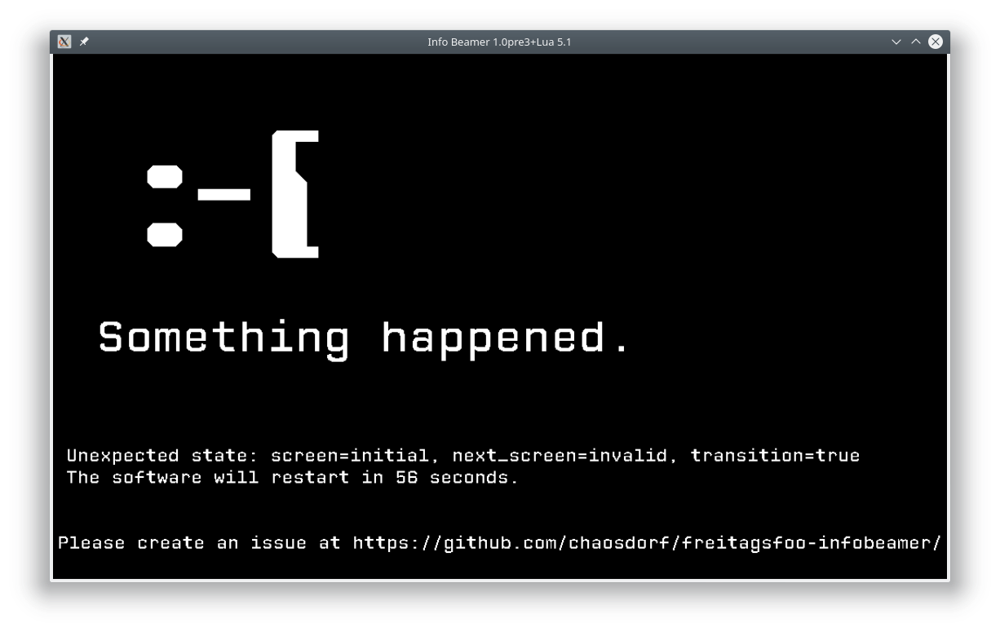

# info-beamer software for Freitagsfoo

This software is meant to be used on info-beamer during a [Freitagsfoo](https://wiki.chaosdorf.de/Freitagsfoo).

> 
> 
> *title screen*

> 
> 
> *talks screen*

> 
> 
> *next talk screen*

## main node

This folder contains the main node which does the animations and switches between the different screens.

On start, the software just displays the background animation.
You'll need to switch to a different screen to see anything meaningful:

```
echo -n "freitagsfoo/screen:title" | nc -u localhost 4444
```

If the state becomes invalid somehow, you'll see this screen:

> 
> 
> *error screen*

In this case you can either wait for the software to reset itself or you can do it manually:

```
echo -n "freitagsfoo/reset:true" | nc -u localhost 4444
```

## background

You need to configura a background by adding a child package called `background`. A simple background which just paints a black screen is included.

## Credits

Used fonts:
 * *Computerfont*: public domain
 * *CP Mono*: CC by Liquitype

Used icons:
 * `user.png`: CC by-nd icons8.com
 * `planner.png`: CC by-nd icons8.com
 * `pesthoernchen.svg`: [muelli](https://blogs.gnome.org/muelli/2009/09/ccc-artwork/)
