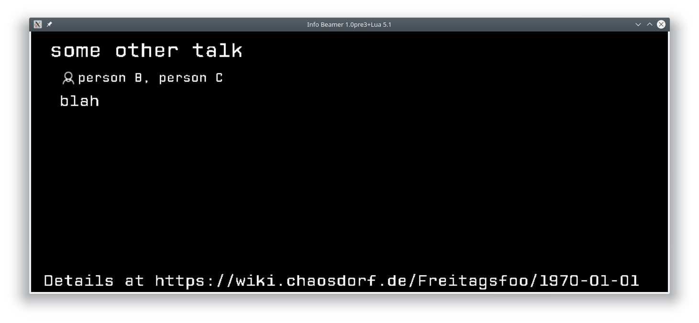

# next talk screen



This is the part of the screen which displays the next talk.

On start, the software just displays the first talk.
You'll probably want to switch to a different one:
(Note that indices start at 1.)

```
echo -n "next_screen/talk_index:2" | nc -u localhost 4444
```
