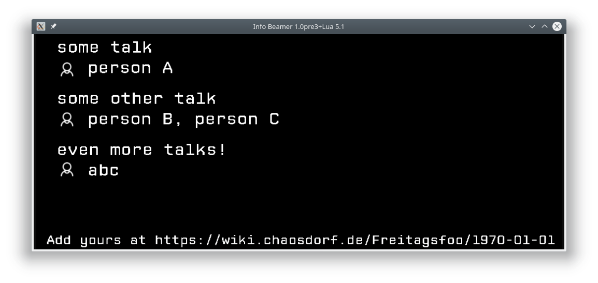

# talks screen

This is the part of the screen which displays the talks.

If there are more than four talks pagination kicks in.

An animation in the main node interleaves this with the title background.
