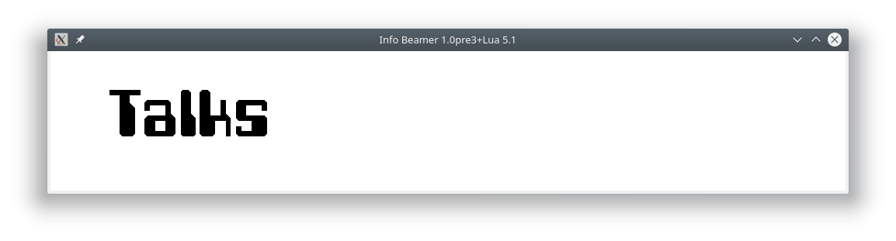

# talks title

This is the part of the screen which contains the title bar for the talks screen.

An animation in the main node interleaves this with the title screen and moves it across the screen.
